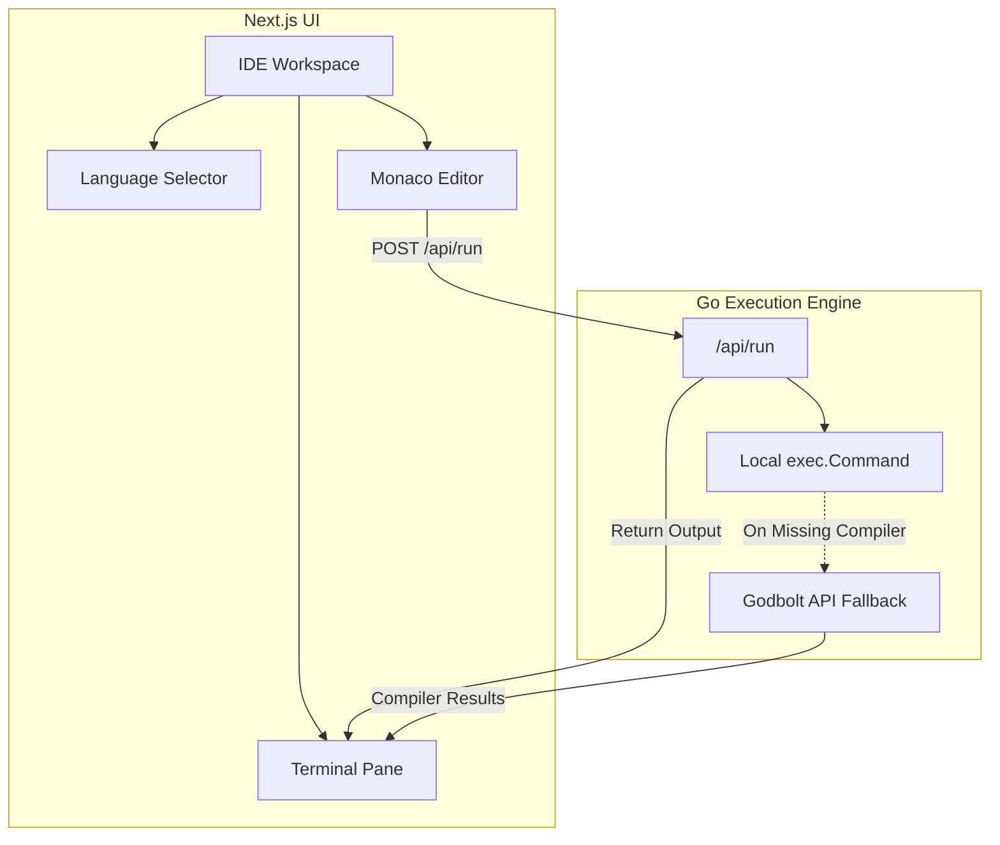

# DataHubIDE 🚀

DataHubIDE is an advanced, high-performance Cloud IDE designed specifically for both professional developers and engineering students. It features a sleek, split-pane user interface with real-time compilation capabilities.

## 🌟 Key Features

- **Split-Pane Workspace:** Code editor and terminal/output window side-by-side for maximum productivity.
- **Multi-Language Support:** Instant boilerplate generation and execution support for C, C++, Python, JavaScript (Node.js), and Go.
- **Smart Execution Engine (Go Backend):** 
  - Attempts to run code locally for zero-latency execution.
  - **Auto-Fallback to Cloud API:** If a local compiler (like `gcc` or `g++`) is missing, the backend seamlessly routes the code to the **Godbolt Compiler Explorer API**, guaranteeing successful execution without requiring heavy local setups.
- **Monaco Editor Integration:** Enjoy VS Code-like intellisense, syntax highlighting, and smooth typing mechanics.

---

## 🏗️ System Architecture

DataHubIDE is powered by a Next.js (React) frontend and an ultra-fast Go backend. 



---

## 🛠️ Technology Stack

| Component | Technology |
| :--- | :--- |
| **Frontend** | React, Next.js, Tailwind CSS, Monaco Editor, Xterm.js |
| **Backend** | Go (Golang), net/http |
| **Execution** | Local OS exec, Godbolt REST API |

---

## 🚀 Getting Started

Follow these steps to run DataHubIDE on your local machine:

### 1. Start the Go Backend
The backend handles code execution and API fallback.
```bash
cd backend
go run ./cmd/server/main.go
```
*The server will start on `https://datahubide.onrender.com`*

### 2. Start the Frontend
The frontend provides the interactive user interface.
```bash
cd frontend
npm install
npm run dev
```
*The UI will be accessible at `https://datahubide.onrender.com`*

---

## 💻 Usage

1. Open `https://datahubide.onrender.com` in your browser.
2. Select your preferred programming language from the left sidebar (C, C++, Python, Go, JS).
3. The editor will automatically populate with a standard "Hello World" template for that language.
4. Click the **Run** button at the top right.
5. The output will be displayed instantly in the terminal pane!

---

*Designed and Built for Developers & Engineers.*
