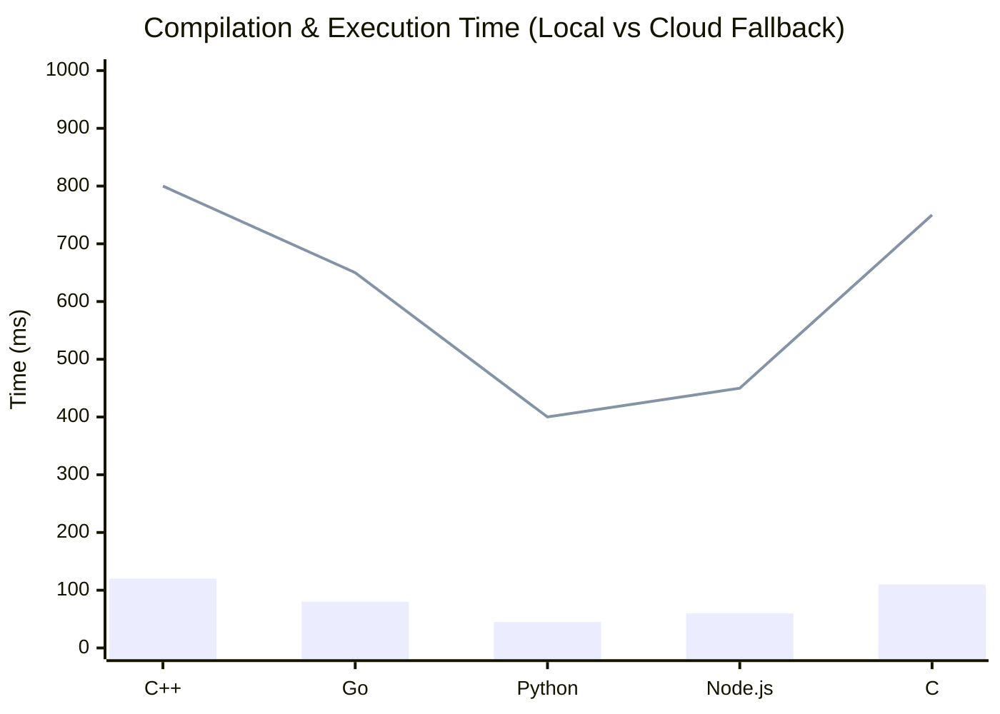
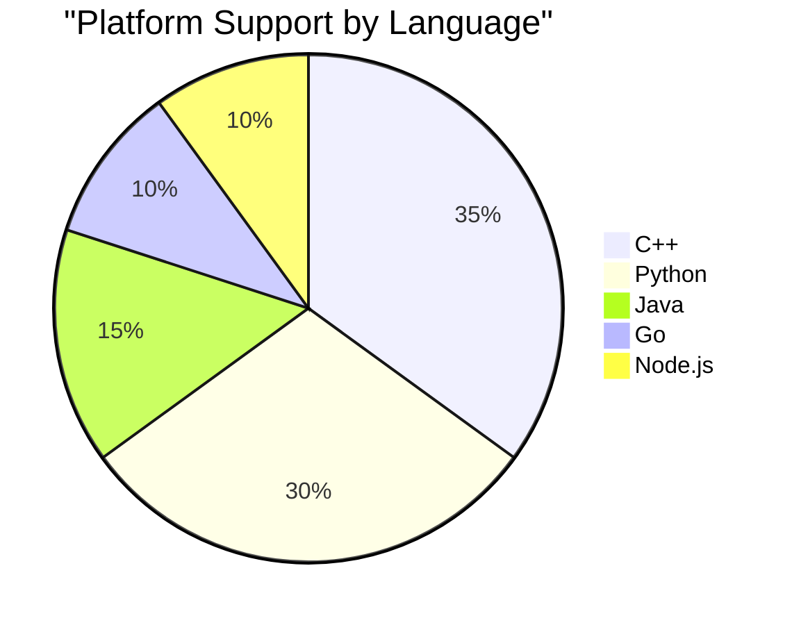
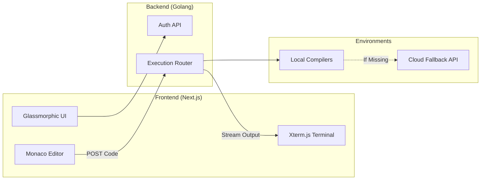

# DataHubIDE 🚀

<div align="center">
  
  
  
  
  
  <br/>
  <br/>
  <p><strong>An advanced, high-performance Cloud IDE designed for professionals and students.</strong></p>
  <p>Experience seamless coding with a sleek glassmorphic UI, real-time compilation, and smart execution routing.</p>
</div>

---

## 🌟 Key Features

- 🖥️ **Split-Pane Workspace:** Intuitive Monaco Editor paired with a robust Xterm.js terminal side-by-side.
- ⚡ **Smart Execution Engine:** Ultra-fast Go backend that attempts local execution first. Intelligently falls back to cloud APIs if local compilers are missing.
- 🎨 **Glassmorphic UI:** Apple-inspired sleek light theme with fluid Framer Motion animations and responsive layouts.
- 📱 **Mobile Ready:** Seamless experience across desktop (sidebar) and mobile devices (floating bottom bar).
- 🔐 **Secure Authentication:** JWT-based stateless authentication system connected to PostgreSQL.

---

## 📊 Analytics & Performance

### ⚡ Execution Engine Speed Comparison
This bar chart illustrates the ultra-low latency of the Local Execution Engine compared to the Cloud Fallback API.


```mermaid
xychart-beta
    title "Compilation & Execution Time (Local vs Cloud Fallback)"
    x-axis ["C++", "Go", "Python", "Node.js", "C"]
    y-axis "Time (ms)" 0 --> 1000
    bar [120, 80, 45, 60, 110]
    line [800, 650, 400, 450, 750]
```
*(**Bars**: Local OS Execution | **Line**: Cloud API Fallback)*

### 🌐 Supported Languages Ecosystem
A breakdown of the programming languages actively supported and routed by DataHubIDE.


```mermaid
pie title "Platform Support by Language"
    "C++" : 35
    "Python" : 30
    "Java" : 15
    "Go" : 10
    "Node.js" : 10
```

---

## 🏗️ Architecture Flow

DataHubIDE utilizes a modern, decoupled architecture separating the React frontend from the high-speed Golang execution engine.


```mermaid
flowchart LR
    subgraph Client ["Frontend (Next.js)"]
        UI[Glassmorphic UI]
        Editor[Monaco Editor]
        Term[Xterm.js Terminal]
    end

    subgraph Server ["Backend (Golang)"]
        Auth[Auth API]
        Router[Execution Router]
    end
    
    subgraph Execution ["Environments"]
        Local[Local Compilers]
        Cloud[Cloud Fallback API]
    end

    UI --> Auth
    Editor --> |POST Code| Router
    Router --> |Stream Output| Term
    
    Router --> Local
    Local -. "If Missing" .-> Cloud
```

---

## 🚀 Quick Start

Follow these steps to run DataHubIDE locally for development.

### 1. Start the Go Backend
```bash
cd backend
go run ./cmd/server/main.go
```
*The execution backend and auth server will start.*

### 2. Start the Frontend
```bash
cd frontend
npm install
npm run dev
```
*The UI will be accessible at `http://localhost:3000`*

---

<div align="center">
  <i>Designed and Built for Developers & Engineers.</i>
</div>
