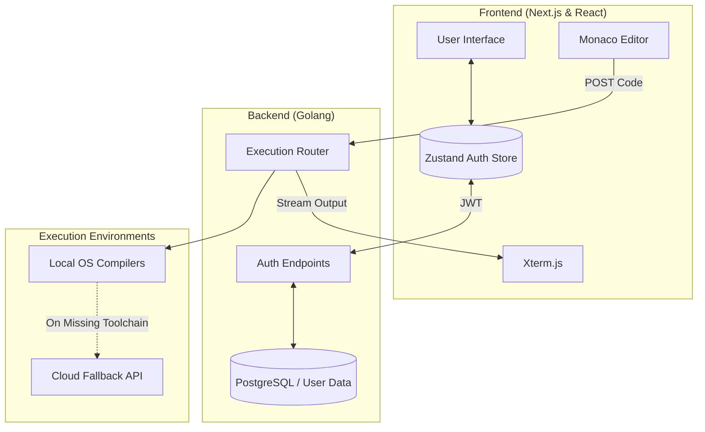
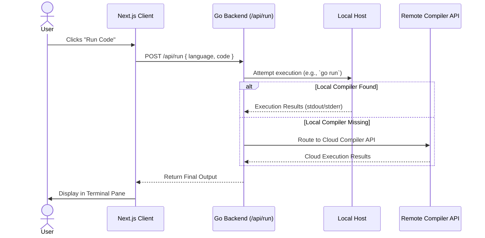

# DataHubIDE 🚀

<div align="center">
  <p><strong>An advanced, high-performance Cloud IDE designed for professionals and students.</strong></p>
  <p>Experience seamless coding with a sleek UI, real-time compilation, and smart execution routing.</p>
</div>

---

## 🌟 Features Overview

- 🖥️ **Split-Pane Workspace:** Intuitive Monaco Editor paired with a robust Xterm.js terminal side-by-side.
- ⚡ **Smart Execution Engine:** Ultra-fast Go backend that attempts local execution first. If compilers are missing, it intelligently falls back to cloud APIs (e.g., Godbolt) to ensure your code always runs.
- 🎨 **Accessibility-First Design:** Features comprehensive theme support, including Light/Dark modes, Soft Dark, and specially calibrated palettes for Protanopia, Deuteranopia, and Tritanopia.
- 🔐 **Secure Authentication:** JWT-based stateless authentication system with beautifully animated Next.js interfaces powered by Framer Motion.
- 🌐 **Multi-Language Support:** Instant boilerplate generation and execution for C, C++, Python, Node.js, and Go.

---

## 🏗️ System Architecture

DataHubIDE utilizes a modern, decoupled architecture separating the React frontend from the high-speed Golang execution engine.


```mermaid
flowchart TB
    subgraph Client ["Frontend (Next.js & React)"]
        UI[User Interface]
        AuthStore[(Zustand Auth Store)]
        Editor[Monaco Editor]
        Terminal[Xterm.js]
    end

    subgraph Server ["Backend (Golang)"]
        AuthAPI[Auth Endpoints]
        ExecAPI[Execution Router]
        DB[(PostgreSQL / User Data)]
    end

    subgraph Execution_Env ["Execution Environments"]
        Local[Local OS Compilers]
        Cloud[Cloud Fallback API]
    end

    UI <--> AuthStore
    Editor --> |POST Code| ExecAPI
    ExecAPI --> |Stream Output| Terminal
    
    AuthStore <--> |JWT| AuthAPI
    AuthAPI <--> DB
    
    ExecAPI --> Local
    Local -. "On Missing Toolchain" .-> Cloud
```

---

## 🔄 Code Execution Workflow

When a user hits "Run", the system follows a strict, optimized path to ensure the fastest possible execution time.


```mermaid
sequenceDiagram
    actor User
    participant Frontend as Next.js Client
    participant API as Go Backend (/api/run)
    participant Local as Local Host
    participant Remote as Remote Compiler API

    User->>Frontend: Clicks "Run Code"
    Frontend->>API: POST /api/run { language, code }
    API->>Local: Attempt execution (e.g., `go run`)
    
    alt Local Compiler Found
        Local-->>API: Execution Results (stdout/stderr)
    else Local Compiler Missing
        API->>Remote: Route to Cloud Compiler API
        Remote-->>API: Cloud Execution Results
    end
    
    API-->>Frontend: Return Final Output
    Frontend->>User: Display in Terminal Pane
```

---

## 🛠️ Technology Stack

| Layer | Technologies Used |
| :--- | :--- |
| **Frontend** | React 19, Next.js 16, Tailwind CSS v4, Framer Motion, Monaco Editor, Zustand |
| **Backend** | Go (Golang), net/http, JWT Authentication |
| **Execution** | OS `exec.Command`, REST API fallbacks |
| **Deployment** | Docker, Render (Cloud Hosting) |

---

## 🚀 Getting Started

Follow these steps to run DataHubIDE locally for development.

### 1. Start the Go Backend
The backend handles code execution, routing, and user authentication.
```bash
cd backend
go run ./cmd/server/main.go
```
*The server will start on `http://localhost:8080`*

### 2. Start the Frontend
The frontend provides the interactive user interface and IDE workspace.
```bash
cd frontend
npm install
npm run dev
```
*The UI will be accessible at `http://localhost:3000`*

*(Note: Production deployments are available at `https://datahubide.onrender.com`)*

---

<div align="center">
  <i>Designed and Built for Developers & Engineers.</i>
</div>
